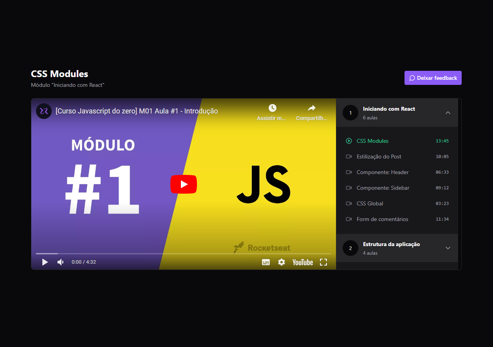

<h1 align="center"></h1>

<h3 align="center">Redux + Zustand</h3>

<p align="center">“Software developers are students forever 🧠”</p>

<p align="center">
  <a href="#about">Sobre</a>&nbsp;&nbsp;&nbsp;|&nbsp;&nbsp;&nbsp;
  <a href="#install">Instalação</a>&nbsp;&nbsp;&nbsp;|&nbsp;&nbsp;&nbsp;
  <a href="#challenge">Desafios</a>&nbsp;&nbsp;&nbsp;|&nbsp;&nbsp;&nbsp;
  <a href="#technologies">Tecnologias</a>
</p>

## :speech_balloon: Sobre <a name="about"></a>

> Reduz + Zustand é um player de módulos / aulas :)

<br />
<table>
  <tr>
    <td colspan="1">Web App</td>
  </tr>
  <tr>
    <td></td></td>
  </tr>
</table>

## :warning: Instalação <a name="install"></a>

```bash
# Instalar as dependências necessárias:
$ npm install

# Iniciar o projeto (front):
$ npm run dev
> http://localhost:5173

# Iniciar o projeto (back):
$ npm run server
> http://localhost:3000
> http://localhost:3000/courses

# Testes
$ npm run test
$ npm run test:watch
```

## :triangular_flag_on_post: Desafio <a name="challenge"></a>

> Aplicar conceitos do Reduz + Zustand.

## :heavy_check_mark: Tecnologias <a name="technologies"></a>

-   [Redux](https://react-redux.js.org/)
-   [Zustand](https://zustand-demo.pmnd.rs/)
-   [TypeScript](https://www.typescriptlang.org/)
-   [TailWind CSS](https://tailwindcss.com/)

---

by [Douglas Scaini](https://www.github.com/douglasscaini) ❤️
